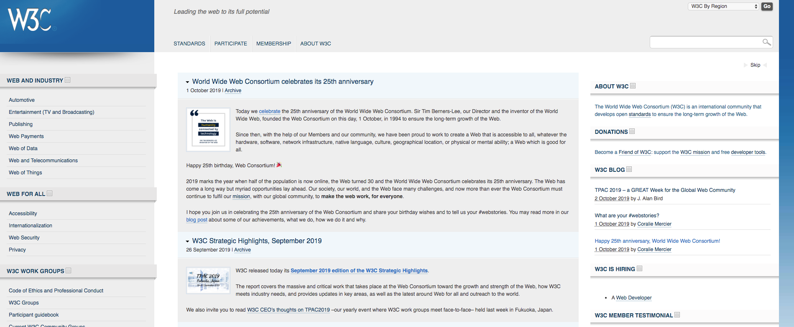

# 2019.10 / JavaScript 月刊 - W3C 生日快乐

[返回首页](https://github.com/hijiangtao/javascript-articles-monthly)

1989年 Tim Berners-Lee 发明了万维网「World Wide Web」，随后在第三年全球第一个网站在 CERN 正式上线。1993年，CERN 宣布万维网免费对所有人开放... 

**1994年10月1日 Tim Berners-Lee 创立万维网联盟，即 World Wide Web Consortium，简称 W3C.**

Tim Berners-Lee 在一封写给所有人的公开信中提到：“我理想中的 Web 是一个自由开放且充满创造力的平台，在这里，无论何人身处何时何地，都可以平等地共享信息、获得机遇，还能够实现跨地域跨文化的合作。虽然保持开放性并不容易，万维网还是按照当初的愿景发展到了现在”。风雨25年，W3C 生日快乐! 

*注：2013年 CERN 恢复了世界上第一个网站的服务器和网页面貌，感兴趣的朋友可以移步 <http://info.cern.ch/>. *

## 清单

本期话题包含性能优化、实用指南、tensorflow.js、V8、D3、TypeScript、数值精度、JavaScript 生态、游戏等。

* [维基百科是如何优化 JavaScript 初始化消耗的](https://phabricator.wikimedia.org/phame/live/7/post/175/wikipedia_s_javascript_initialisation_on_a_budget/)
* [更好的编写 JavaScript 实用指南](https://stackoverflow.blog/2019/09/12/practical-ways-to-write-better-javascript/)
* [前端工程师机器学习教程 - Tensorflow.js](https://www.smashingmagazine.com/2019/09/machine-learning-front-end-developers-tensorflowjs/)
* [V8 是如何在 V8 Lite 上更好工作的](https://v8.dev/blog/v8-lite)
* [如何用九行代码生成 PI 的百万小数位](http://ajennings.net/blog/a-million-digits-of-pi-in-9-lines-of-javascript.html)
* [如何学习 D3](https://wattenberger.com/blog/d3)
* [JavaScript 与 TypeScript 重中的 void](https://fettblog.eu/void-in-javascript-and-typescript/)
* [0.1+0.2 不等于 0.3 的原因](https://www.youtube.com/watch?v=wPBjd-vb9eI)
* [为什么 JavaScript 工具如此难用](https://www.swyx.io/writing/js-tooling/)
* 背后的故事 - [如何用 13KB 的 JavaScript 代码制作实时策略游戏](https://phoboslab.org/log/2019/09/voidcall-making-of)

## 动态

* [Firefox 69 发布](https://hacks.mozilla.org/2019/09/firefox-69-a-tale-of-resize-observer-microtasks-css-and-devtools/)
* [W3C 重点工作报告（2019年9月版）](https://www.w3.org/2019/09/w3c-highlights/)
* [Node.js 12.11 发布](https://nodejs.org/en/blog/release/v12.11.0/) - 工作线程已经成为稳定特性
* [V8 7.8 发布](https://v8.dev/blog/v8-release-78)
